# Three-Tier AWS Architecture with Terraform (Modular)

A modular Terraform project that provisions a production-style three-tier architecture on AWS, consisting of a web/load balancer tier, an application tier, and a database tier — all deployed across two Availability Zones in `eu-north-1`.

## Architecture Overview

```
Internet
    │
    ▼
┌─────────────────────────────────────┐
│  Application Load Balancer (ALB)    │  ← Public Subnets (AZ-a, AZ-b)
└─────────────────────────────────────┘
    │
    ▼
┌─────────────────────────────────────┐
│  Auto Scaling Group (Apache EC2)    │  ← App Private Subnets (AZ-a, AZ-b)
└─────────────────────────────────────┘
    │
    ▼
┌─────────────────────────────────────┐
│  EC2 Database Instance (MySQL)      │  ← DB Private Subnets (AZ-a, AZ-b)
└─────────────────────────────────────┘

┌─────────────────────────────────────┐
│  Bastion Host                       │  ← Public Subnet (AZ-a)
└─────────────────────────────────────┘
```

## Project Structure

```
terraform-three-tier-modular/
├── main.tf                  # Root module - wires all modules together
├── variables.tf             # Root input variables
├── outputs.tf               # Root outputs (ALB DNS, Bastion IP, DB IP)
├── terraform.tfvars         # Variable values
├── provider.tf              # AWS provider configuration
├── backend.tf               # S3 remote state backend
└── modules/
    ├── vpc/                 # VPC, subnets, IGW, NAT Gateway, route tables
    ├── security_groups/     # SGs for ALB, app, bastion, and DB
    ├── alb/                 # Application Load Balancer, target group, listener
    ├── asg/                 # Launch template and Auto Scaling Group
    └── compute/             # Bastion host and EC2 DB instance
```

## Modules

| Module | Resources |
|---|---|
| `vpc` | VPC, 2 public subnets, 2 app subnets, 2 DB subnets, IGW, NAT GW, route tables |
| `security_groups` | ALB SG, App SG, Bastion SG, DB SG |
| `alb` | Application Load Balancer, target group, HTTP listener |
| `asg` | Launch template (Apache2), Auto Scaling Group (min: 1, desired: 2, max: 4) |
| `compute` | Bastion EC2 (public), DB EC2 with MySQL (private) |

## Traffic Flow

- **Inbound:** Internet → ALB (port 80) → App instances (port 80)
- **Admin access:** Your machine → Bastion (SSH) → App/DB instances (SSH)
- **DB access:** App instances → DB instance (port 3306)
- **Outbound:** Private instances → NAT Gateway → Internet (for package installs)

## Prerequisites

- [Terraform](https://developer.hashicorp.com/terraform/install) >= 1.0
- AWS CLI configured with appropriate credentials
- An existing EC2 key pair in `eu-north-1`
- An existing S3 bucket for remote state storage

## Remote State Backend

This project uses S3 native state locking (AWS provider v6+):

```hcl
terraform {
  backend "s3" {
    bucket       = "your-terraform-state-bucket"
    key          = "three-tier/terraform.tfstate"
    region       = "eu-north-1"
    use_lockfile = true
    encrypt      = true
  }
}
```

Update `backend.tf` with your S3 bucket name before initializing.

## Usage

1. **Clone the repository**
```bash
git clone <repo-url>
cd terraform-three-tier-modular
```

2. **Update variables**

Edit `terraform.tfvars`:
```hcl
region       = "eu-north-1"
key_name     = "your-key-pair-name"
project_name = "Three-Tier"
trusted_cidr = "your-ip/32"   # restrict SSH access to bastion
```

3. **Initialize Terraform**
```bash
terraform init
```

4. **Plan and apply**
```bash
terraform plan
terraform apply
```

5. **Access the application**

After apply, Terraform outputs:
```
alb_dns_name      = "Three-Tier-alb-xxxxxxxxx.eu-north-1.elb.amazonaws.com"
bastion_public_ip = "x.x.x.x"
db_private_ip     = "10.0.20.x"
```

Open the ALB DNS name in your browser to access the app.

## SSH Access

SSH into app or DB instances via the bastion host:

```bash
# Copy your key to the bastion
scp -i ~/path/to/key.pem ~/path/to/key.pem ubuntu@<bastion-public-ip>:~/.ssh/

# SSH into bastion
ssh -i ~/path/to/key.pem ubuntu@<bastion-public-ip>

# From bastion, SSH into app or DB instance
ssh -i ~/.ssh/key.pem ubuntu@<private-ip>
```

## Variables

| Variable | Description | Default |
|---|---|---|
| `region` | AWS region | `eu-north-1` |
| `vpc_cidr` | VPC CIDR block | `10.0.0.0/16` |
| `public_subnet_cidrs` | Public subnet CIDRs | `["10.0.1.0/24", "10.0.2.0/24"]` |
| `app_subnet_cidrs` | App subnet CIDRs | `["10.0.10.0/24", "10.0.11.0/24"]` |
| `db_subnet_cidrs` | DB subnet CIDRs | `["10.0.20.0/24", "10.0.21.0/24"]` |
| `availability_zones` | AZs to deploy into | `["eu-north-1a", "eu-north-1b"]` |
| `ami_id` | Ubuntu 22.04 LTS AMI | `ami-0a4640f53fa171eb4` |
| `instance_type` | EC2 instance type | `t3.micro` |
| `key_name` | EC2 key pair name | required |
| `project_name` | Tag prefix for all resources | `Three-Tier` |

## Screenshots

### Terraform Output
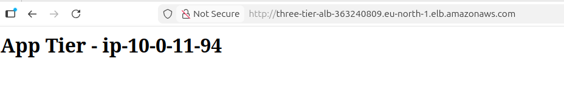
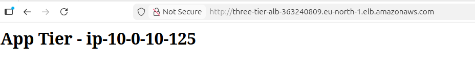

### EC2 Instances
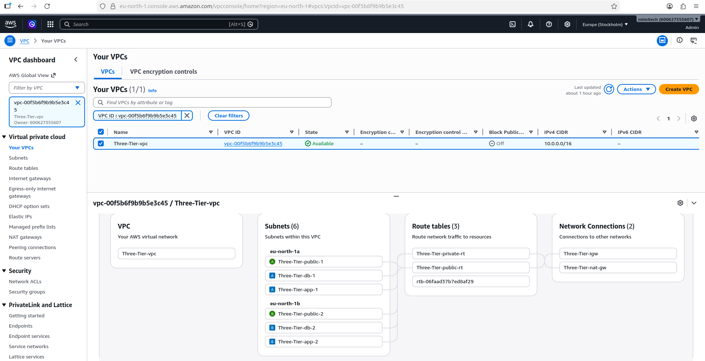
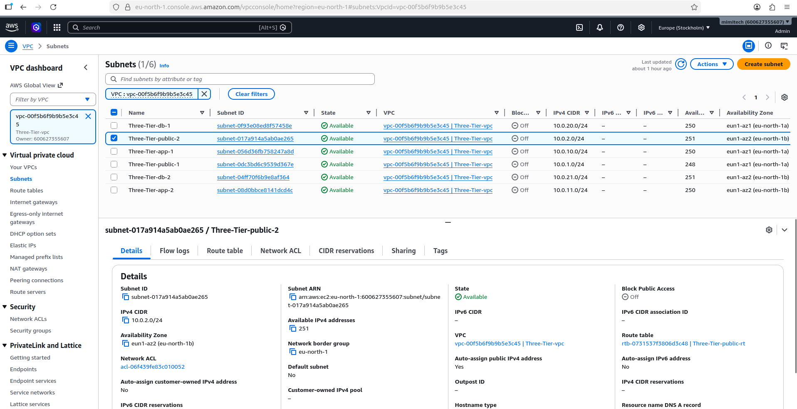

### Target Group - Healthy Targets
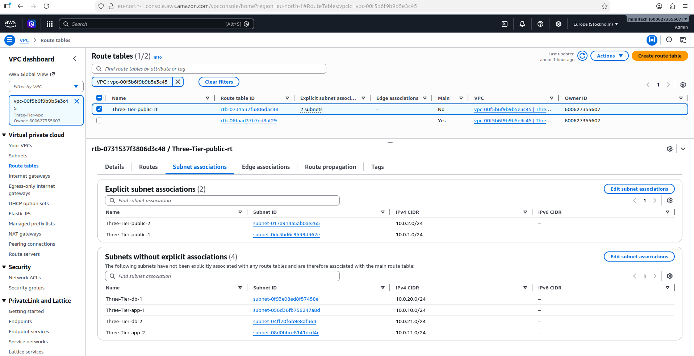
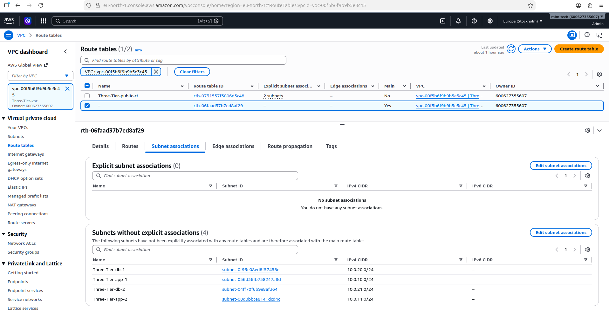

### Application Load Balancer
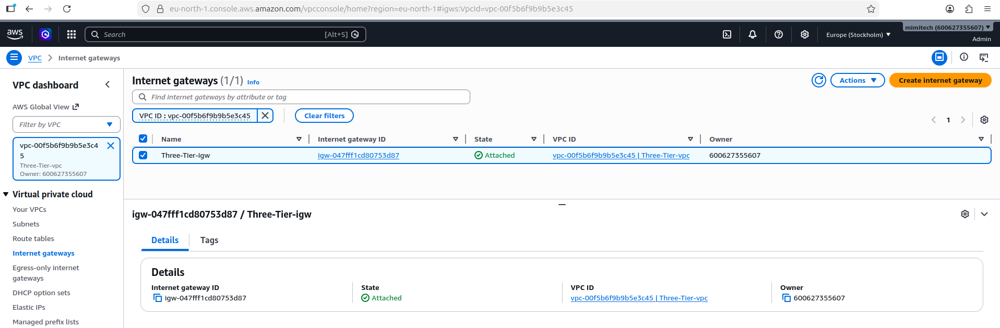

### VPC Subnets
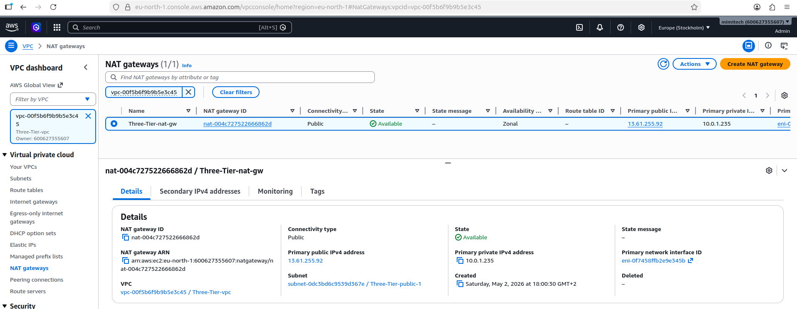

### Security Groups
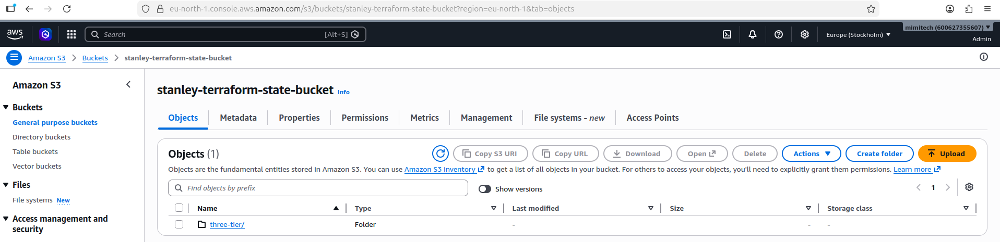

### App in Browser (ALB Load Balancing)
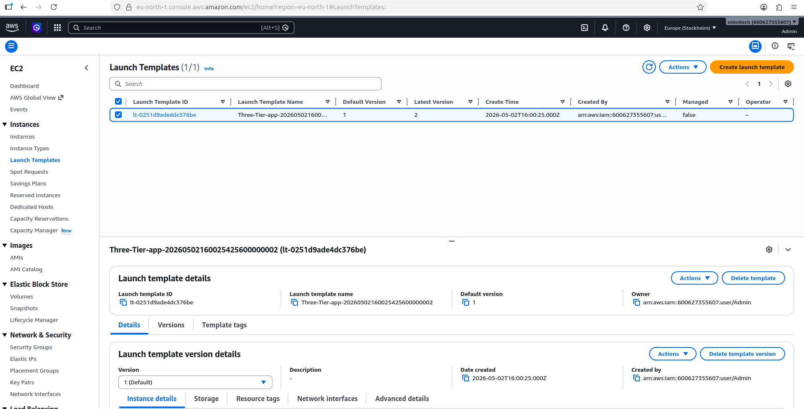
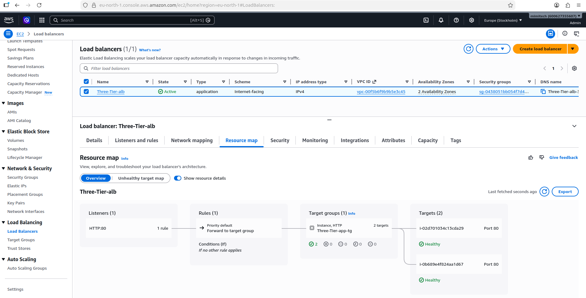
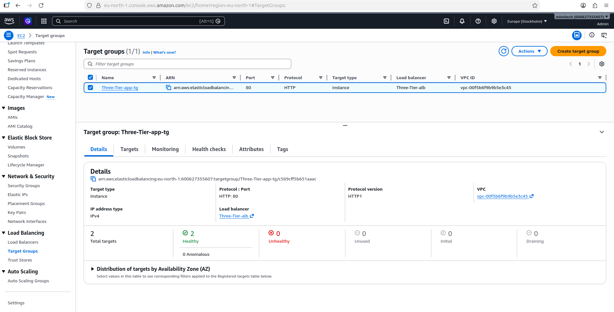

## Destroy

To tear down all infrastructure:
```bash
terraform destroy
```

## Notes

- The NAT Gateway is deployed in `eu-north-1a` only (single AZ) to reduce costs. For production, deploy one per AZ for high availability.
- The `trusted_cidr` variable in the security_groups module defaults to `0.0.0.0/0`. Always restrict this to your IP in production.
- App instances use `apt` with IPv4 forced (`/etc/apt/apt.conf.d/99force-ipv4`) to avoid IPv6 connectivity issues in private subnets.
